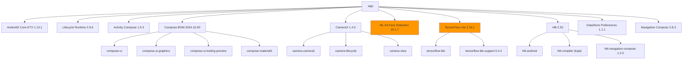
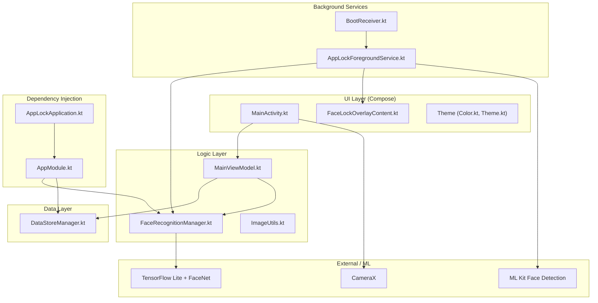

# Deep Analysis: `app/` and `gradle/` Directories

**Project:** Kids Face Shield (`com.shantanu.shield`)  
**Root Project Name:** `My Application`

---

## 1. Project Overview

This is a **single-module Android application** that uses **face recognition to lock/unlock apps** on the device. It captures the parent's face via the camera, then monitors app launches via a foreground service — if a child tries to open a locked app, it shows a face-lock overlay requiring the parent's face to proceed.

### Core Tech Stack

| Layer | Technology |
|---|---|
| Language | Kotlin 2.0.21 |
| UI | Jetpack Compose (BOM `2024.10.00`) + Material3 |
| DI | Hilt 2.52 (with `kapt`) |
| Camera | CameraX 1.4.0 |
| Face Detection | ML Kit Face Detection 16.1.7 |
| Face Recognition | TensorFlow Lite 2.16.1 + FaceNet `.tflite` model |
| Persistence | DataStore Preferences 1.1.1 |
| Navigation | Navigation Compose 2.8.3 |
| Build System | Gradle 9.3.1 + AGP 8.7.2 (Kotlin DSL) |
| JVM Target | JDK 21 (daemon) / JVM 11 (compilation) |

---

## 2. `gradle/` Directory — Build Infrastructure

### 2.1 Gradle Wrapper (`gradle/wrapper/`)

| File | Purpose |
|---|---|
| [gradle-wrapper.properties](file:///c:/Users/Shantanu%20Jha/AndroidStudioProjects/MyApplication/gradle/wrapper/gradle-wrapper.properties) | Pins Gradle distribution version |
| `gradle-wrapper.jar` (45 KB) | Bootstrapper JAR |

- **Gradle Version:** `9.3.1` (very recent — released 2026)
- **Distribution Type:** `bin` (no source/docs, lighter download)
- **SHA-256 Validation:** ✅ Enabled (`distributionSha256Sum` is set)
- **Network Timeout:** 10 seconds

> [!TIP]
> Using the `bin` distribution is correct for CI/builds. If you want IDE Gradle source navigation, switch to `-all.zip`.

### 2.2 Gradle Daemon JVM (`gradle/gradle-daemon-jvm.properties`)

[gradle-daemon-jvm.properties](file:///c:/Users/Shantanu%20Jha/AndroidStudioProjects/MyApplication/gradle/gradle-daemon-jvm.properties)

- **Toolchain Version:** JDK 21
- **Auto-provisioning:** Uses [Foojay Disco API](https://github.com/gradle/foojay-toolchains) for cross-platform JDK download
- Covers: Linux, macOS, Windows, FreeBSD, Unix (both x86_64 and aarch64)

> [!NOTE]
> The Foojay resolver plugin is also declared in [settings.gradle.kts](file:///c:/Users/Shantanu%20Jha/AndroidStudioProjects/MyApplication/settings.gradle.kts) at line 15: `id("org.gradle.toolchains.foojay-resolver-convention") version "1.0.0"`.

### 2.3 Version Catalog (`gradle/libs.versions.toml`)

[libs.versions.toml](file:///c:/Users/Shantanu%20Jha/AndroidStudioProjects/MyApplication/gradle/libs.versions.toml)

This is a well-organized catalog with **18 version entries**, **24 library aliases**, and **4 plugin aliases**.

#### Version Breakdown

| Category | Library | Version |
|---|---|---|
| **Android Gradle Plugin** | AGP | 8.7.2 |
| **Kotlin** | Kotlin + Compose Plugin | 2.0.21 |
| **Core** | core-ktx | 1.13.1 |
| **Lifecycle** | lifecycle-runtime-ktx | 2.8.6 |
| **Activity** | activity-compose | 1.9.3 |
| **Compose** | BOM | 2024.10.00 |
| **CameraX** | camera2, lifecycle, view | 1.4.0 |
| **ML Kit** | face-detection | 16.1.7 |
| **TensorFlow Lite** | tensorflow-lite | 2.16.1 |
| **TensorFlow Lite Support** | tensorflow-lite-support | 0.4.4 |
| **Hilt** | hilt-android + compiler | 2.52 |
| **Hilt Nav** | hilt-navigation-compose | 1.2.0 |
| **DataStore** | datastore-preferences | 1.1.1 |
| **Navigation** | navigation-compose | 2.8.3 |
| **Testing** | JUnit 4.13.2, AndroidX JUnit 1.2.1, Espresso 3.6.1 |

#### Plugins Declared

| Alias | Plugin ID |
|---|---|
| `android-application` | `com.android.application` |
| `kotlin-android` | `org.jetbrains.kotlin.android` |
| `kotlin-compose` | `org.jetbrains.kotlin.plugin.compose` |
| `hilt-android` | `com.google.dagger.hilt.android` |

---

## 3. Root Build Files

### 3.1 [build.gradle.kts](file:///c:/Users/Shantanu%20Jha/AndroidStudioProjects/MyApplication/build.gradle.kts) (Root)

Minimal — declares all 4 plugins with `apply false` so they're available for the `:app` module.

### 3.2 [settings.gradle.kts](file:///c:/Users/Shantanu%20Jha/AndroidStudioProjects/MyApplication/settings.gradle.kts)

- **Repository Mode:** `FAIL_ON_PROJECT_REPOS` — enforces centralized repo declaration (good practice)
- **Repos:** Google (with content-filtered regex) + Maven Central
- **Modules:** Single module `:app`

### 3.3 [gradle.properties](file:///c:/Users/Shantanu%20Jha/AndroidStudioProjects/MyApplication/gradle.properties)

| Property | Value | Notes |
|---|---|---|
| `org.gradle.jvmargs` | `-Xmx2048m` | 2 GB heap for Gradle daemon |
| `kotlin.code.style` | `official` | Standard Kotlin formatting |
| `android.useAndroidX` | `true` | AndroidX migration ✅ |
| `android.enableJetifier` | `true` | ⚠️ See issues below |

---

## 4. `app/` Directory — Application Module

### 4.1 [build.gradle.kts](file:///c:/Users/Shantanu%20Jha/AndroidStudioProjects/MyApplication/app/build.gradle.kts) (App)

#### Identity

| Field | Value |
|---|---|
| Namespace | `com.shantanu.shield` |
| Application ID | `com.shantanu.shield` |
| Min SDK | 24 (Android 7.0 Nougat) |
| Target SDK | 35 (Android 15) |
| Compile SDK | 35 |
| Version | `1.0` (code: 1) |

#### Plugins Applied

```
com.android.application
org.jetbrains.kotlin.android
org.jetbrains.kotlin.plugin.compose
com.google.dagger.hilt.android
kotlin-kapt
```

#### Build Features

| Feature | Enabled | Notes |
|---|---|---|
| Compose | ✅ | Primary UI framework |
| ViewBinding | ✅ | Potentially unused — all UI is Compose |
| mlModelBinding | ❌ | Explicitly disabled with comment: "Fixed: Disabled to prevent 'No metadata' errors" |

#### Compilation Config

- **Java:** Source & Target = Java 11
- **Kotlin JVM Target:** JVM 11
- **noCompress:** `.tflite` files excluded from compression (required for memory-mapped TFLite loading)

#### Dependency Conflict Resolution (Lines 53–62)

This is the most interesting part of the build file:

```kotlin
configurations.all {
    // Excludes Google's newer LiteRT (rebranded TF Lite) to prevent conflicts
    exclude(group = "com.google.ai.edge.litert", module = "litert-api")
    exclude(group = "com.google.ai.edge.litert", module = "litert")
    
    resolutionStrategy {
        // Forces specific older TF Lite versions
        force("org.tensorflow:tensorflow-lite:2.16.1")
        force("org.tensorflow:tensorflow-lite-api:2.16.1")
        force("org.tensorflow:tensorflow-lite-support:0.4.4")
    }
}
```

> [!WARNING]
> This block reveals that **ML Kit (16.1.7) transitively pulls in Google's LiteRT** (the rebranded TensorFlow Lite), which conflicts with the direct TF Lite 2.16.1 dependency. The workaround is aggressive: exclude LiteRT entirely and force-pin TF Lite versions. This works but is fragile — a future ML Kit update could break.

#### Dependency Map



### 4.2 [proguard-rules.pro](file:///c:/Users/Shantanu%20Jha/AndroidStudioProjects/MyApplication/app/proguard-rules.pro)

Default template — **no custom rules added**. Release minification is also disabled (`isMinifyEnabled = false`).

> [!NOTE]
> ProGuard/R8 is entirely inactive. For a production release, you'll want to enable minification and add keep rules for TFLite and Hilt.

---

## 5. Source Code Architecture (`app/src/`)

### 5.1 Package Structure

```
com.shantanu.shield/                   ← Main package (active)
├── AppLockApplication.kt              ← Hilt @HiltAndroidApp entry point
├── MainActivity.kt          (22 KB)   ← Main Compose activity
├── MainViewModel.kt         (5.4 KB)  ← ViewModel for state management
├── data/
│   └── DataStoreManager.kt  (2.4 KB)  ← Preferences DataStore wrapper
├── di/
│   └── AppModule.kt         (824 B)   ← Hilt @Module for DI
├── face/
│   └── FaceRecognitionManager.kt (4.6 KB) ← FaceNet TFLite model wrapper
├── overlay/
│   └── FaceLockOverlayContent.kt (10 KB)  ← Compose overlay UI for face lock
├── receiver/
│   └── BootReceiver.kt      (545 B)   ← BOOT_COMPLETED receiver
├── service/
│   └── AppLockForegroundService.kt (12.5 KB) ← Core foreground service
├── ui/theme/
│   ├── Color.kt              (295 B)  ← Color definitions
│   └── Theme.kt              (1.2 KB) ← Material3 theme
└── util/
    └── ImageUtils.kt         (1.3 KB) ← Image processing helpers

com.shantanu.guard/                    ← ⚠️ Appears unused/dead
└── AppLockApplication.kt     (26 B)   ← Stub file (26 bytes!)

com.example.myapplication/             ← ⚠️ Leftover from project template
└── AppLockApplication.kt              ← Likely dead code
```

> [!WARNING]
> **Dead code detected:** The `com.shantanu.guard` (26 bytes) and `com.example.myapplication` packages appear to be leftover stubs. The manifest points to `com.shantanu.shield.AppLockApplication` — these other packages are unreferenced.

### 5.2 AndroidManifest.xml

[AndroidManifest.xml](file:///c:/Users/Shantanu%20Jha/AndroidStudioProjects/MyApplication/app/src/main/AndroidManifest.xml)

#### Permissions

| Permission | Purpose |
|---|---|
| `CAMERA` | Face capture via CameraX |
| `SYSTEM_ALERT_WINDOW` | Draw overlay on top of other apps |
| `FOREGROUND_SERVICE` | Keep service alive |
| `FOREGROUND_SERVICE_CAMERA` | Camera access from FGS |
| `FOREGROUND_SERVICE_SPECIAL_USE` | Custom FGS type declaration |
| `RECEIVE_BOOT_COMPLETED` | Auto-start service on boot |
| `PACKAGE_USAGE_STATS` | Detect which app is in foreground |
| `QUERY_ALL_PACKAGES` | List all installed apps |

#### Components

| Type | Class | Notes |
|---|---|---|
| Application | `AppLockApplication` | `@HiltAndroidApp` entry |
| Activity | `MainActivity` | Launcher, Compose-based |
| Service | `AppLockForegroundService` | FGS type: `camera\|specialUse` |
| Receiver | `BootReceiver` | Starts service after reboot |

### 5.3 Resources (`res/`)

| Directory | Contents |
|---|---|
| `drawable/` | Launcher icon vectors (background + foreground) |
| `mipmap-*/` | 6 density variants + adaptive icon config |
| `raw/` | `keep.txt` only (resource shrinker keep file) |
| `values/` | `colors.xml`, `strings.xml`, `themes.xml` |
| `xml/` | `accessibility_service_config.xml`, `backup_rules.xml`, `data_extraction_rules.xml` |

### 5.4 Assets (`assets/`)

| File | Size | Purpose |
|---|---|---|
| `facenet.tflite` | **5.2 MB** | FaceNet face-embedding model for face recognition |
| `PLACEHOLDER.txt` | 50 B | Placeholder file |

### 5.5 ML Directory (`ml/`)

**Empty.** `mlModelBinding` is disabled in the build file. The TFLite model is loaded directly from `assets/` instead.

---

## 6. Identified Issues & Recommendations

### 🔴 Critical

| # | Issue | Details |
|---|---|---|
| 1 | **Jetifier still enabled** | `android.enableJetifier=true` in `gradle.properties`. All your dependencies are AndroidX-native — Jetifier adds ~2–4s to every build for zero benefit. Set to `false`. |
| 2 | **TFLite/LiteRT conflict workaround is fragile** | The `configurations.all` exclusion + force block works now but will likely break on the next ML Kit update. Consider migrating fully to LiteRT or pinning ML Kit to a version that doesn't pull LiteRT. |

### 🟡 Medium

| # | Issue | Details |
|---|---|---|
| 3 | **Dead code packages** | `com.shantanu.guard` (26B stub) and `com.example.myapplication` are unused — delete them. |
| 4 | **ViewBinding enabled but unused** | If all UI is Compose, disable `viewBinding = true` in build features to reduce generated code. |
| 5 | **ProGuard/R8 disabled** | `isMinifyEnabled = false` for release. Before publishing, enable R8 and add keep rules for TFLite model classes and Hilt. |
| 6 | **`kapt` instead of KSP** | Hilt now supports KSP (since 2.51+). Migrating from `kapt` to `ksp` would improve build speed by ~20-30%. |

### 🟢 Minor

| # | Issue | Details |
|---|---|---|
| 7 | **`PLACEHOLDER.txt` in assets** | Remove this placeholder file to reduce APK size slightly. |
| 8 | **Version `1.0` / code `1`** | Ensure version management is planned before Play Store release. |
| 9 | **`org.gradle.parallel`** | Currently commented out. Doesn't matter for single-module, but enable it if you add more modules. |

---

## 7. Architecture Diagram



---

## 8. Summary

This is a **well-structured single-module Android app** using modern Jetpack libraries. The main complexity lies in the ML pipeline (ML Kit → TFLite FaceNet) and the foreground service that monitors app launches. The Gradle setup is mostly clean and uses the modern version catalog pattern, though there are some housekeeping items (dead code, Jetifier, kapt→KSP migration) that would improve build health before a production release.
